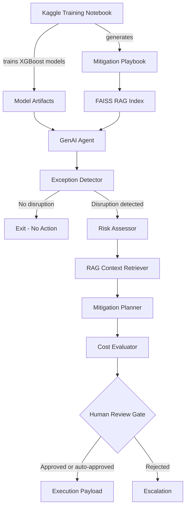

# Supply Chain GenAI Agent


End-to-end supply-chain disruption resolution system combining **XGBoost**, **RAG**, and a **LangGraph multi-agent workflow**.

> A portfolio project demonstrating how classical ML models and GenAI agents can be combined to detect supply-chain disruptions, retrieve mitigation knowledge, evaluate cost tradeoffs, and generate auditable decision payloads.

The project separates model training from GenAI inference:

- The notebook trains ML models and generates artifacts.
- The Python agent loads trained artifacts and runs the GenAI/RAG workflow.

---

## Project Overview

This system detects and resolves supply-chain disruptions using a hybrid ML + GenAI architecture.

It supports:

- Disruption detection using a trained XGBoost classifier
- Shipping-cost prediction using a trained XGBoost regressor
- RAG over a mitigation playbook using FAISS and HuggingFace embeddings
- Groq-hosted LLM reasoning for risk assessment and mitigation planning
- LangGraph-based multi-agent orchestration
- Pydantic structured outputs for schema-controlled agent responses
- Human-in-the-loop approval for high-risk or low-confidence decisions
- Audit trail and ERP/TMS-style execution payload generation
- Replay mode for historical Kaggle rows
- Separated training and inference artifacts for production-style deployment

---

## Motivation

Supply-chain teams often need to triage disruptions across route risk, product criticality, delay impact, cost tradeoffs, and mitigation options. This project explores how ML models and GenAI agents can work together to support faster, more auditable disruption-resolution decisions.

---

## Architecture



---

## Repository Structure

```text
supply-chain-genai-agent/
  README.md
  requirements.txt
  .env.example
  .gitignore
  .dockerignore
  Dockerfile
  api.py
  constants.py

  supply_chain_genai_agent_groq_hf.py

  data/
    global_supply_chain_disruption_v1.csv

  notebooks/
    supply_chain_disruption_cost_model_training.ipynb

  supply_chain_agent_training_outputs/
    models/
      disruption_classifier.pkl
      disruption_classifier_base_xgb.pkl
      disruption_classifier_calibrated.pkl
      active_exception_detector.pkl
      cost_predictor.pkl
      cost_predictor_enhanced.pkl
      feature_config.json

    knowledge_base/
      mitigation_playbook.txt

    reports/
      metrics.json
      metrics_summary.csv
      data_quality_report.json
      classifier_candidate_selection_validation_only.csv
      classifier_validation_threshold_sweep.csv
      classifier_test_threshold_sweep_diagnostic_not_used_for_tuning.csv
      classifier_feature_importance.csv
      classifier_final_test_predictions.csv
      active_exception_feature_importance.csv
      active_exception_final_test_predictions.csv
      agent_compatible_cost_feature_importance.csv
      agent_compatible_cost_final_test_predictions.csv
      enhanced_cost_feature_importance.csv
      enhanced_cost_final_test_predictions.csv
```

The FAISS index is generated locally and is usually not committed:

```text
supply_chain_agent_training_outputs/
  knowledge_base/
    faiss_index/
      index.faiss
      index.pkl
```

---

## Main Components

### 1. Model Training Notebook

Location:

```text
notebooks/supply_chain_disruption_cost_model_training.ipynb
```

The notebook:

- Loads the supply-chain shipment dataset
- Engineers route, product, lead-time, weather, and geopolitical risk features
- Trains an XGBoost disruption classifier
- Trains XGBoost shipping-cost regressors
- Saves model artifacts
- Saves `feature_config.json` for train/inference feature consistency
- Generates `mitigation_playbook.txt` for the RAG agent
- Exports model reports and metrics

### 2. GenAI Agent

Location:

```text
supply_chain_genai_agent_groq_hf.py
```

The agent:

- Loads trained ML artifacts
- Builds or loads a FAISS vector index
- Retrieves mitigation context from the playbook
- Uses Groq LLMs for structured risk and mitigation reasoning
- Uses LangGraph to orchestrate the workflow
- Produces an audit trail and execution payload

---

## Agent Workflow

```text
Order Input
   |
   v
Exception Detector
   |
   | if disruption detected
   v
Risk Assessor
   |
   v
RAG Context Retriever
   |
   v
Mitigation Planner
   |
   v
Cost Evaluator
   |
   v
Human Review Gate
   |
   v
Execution Payload
```

If no disruption is detected, the workflow exits after the exception detector.

---

## Key Design Decisions

- **Separated training and inference** — The notebook trains models and writes artifacts; the agent only loads artifacts and performs inference.
- **LangGraph multi-agent design** — The workflow is split into detector, risk assessor, mitigation planner, cost evaluator, human-review, and execution nodes.
- **FAISS for local RAG** — FAISS keeps the project portable and easy to run locally without requiring a managed vector database.
- **HuggingFace embeddings** — Local sentence-transformer embeddings avoid embedding API costs and make the RAG layer easier to reproduce.
- **Groq LLMs** — Groq is used for fast structured reasoning in the risk and mitigation planning nodes.
- **Pydantic structured outputs** — Agent outputs are constrained to schemas, reducing invalid or inconsistent LLM responses.
- **Human-in-the-loop gate** — High-risk or low-confidence decisions are routed for approval before execution payload generation.
- **Replay mode** — Historical rows can be replayed using known disruption labels without leaking those labels into real-time JSON inference.

---

## Setup

### 1. Clone the repository

```bash
git clone https://github.com/Parthkh28/supply-chain-genai-agent.git
cd supply-chain-genai-agent
```

### 2. Create a virtual environment

On macOS/Linux:

```bash
python -m venv .venv
source .venv/bin/activate
```

On Windows PowerShell:

```powershell
python -m venv .venv
.\.venv\Scripts\Activate.ps1
```

### 3. Install dependencies

```bash
pip install -r requirements.txt
```

> **Note on scikit-learn version:** The packaged model artifacts were serialised with
> `scikit-learn==1.6.1`. `requirements.txt` pins this exact version so pickled calibrated
> classifiers deserialise without `InconsistentVersionWarning`. If you upgrade
> scikit-learn, retrain and re-export the models from the notebook, then update the pin.

---

## Environment Variables

Copy `.env.example` to `.env` and fill in your values. `python-dotenv` is included in
`requirements.txt` and both `api.py` and the CLI agent call `load_dotenv()` at startup,
so **no manual `export` is required** in local development — the `.env` file is loaded
automatically.

```bash
cp .env.example .env
# then edit .env and set GROQ_API_KEY=sk-...
```

The agent reads environment variables from the shell. `.env.example` is provided as a reference; do not commit real API keys.

Required for Groq LLM calls:

```bash
GROQ_API_KEY=your_groq_api_key_here
```

Optional:

```bash
GROQ_MODEL=llama-3.3-70b-versatile
GROQ_FALLBACK_MODEL=llama-3.1-8b-instant
SUPPLY_CHAIN_MODELS_DIR=supply_chain_agent_training_outputs/models
SUPPLY_CHAIN_KB_DIR=supply_chain_agent_training_outputs/knowledge_base
SUPPLY_CHAIN_DATA_PATH=data/global_supply_chain_disruption_v1.csv
SUPPLY_CHAIN_REPLAY_MODE=0
SUPPLY_CHAIN_CLASSIFIER_CAN_TRIGGER_RESOLUTION=0
```

On Windows PowerShell:

```powershell
$env:GROQ_API_KEY="your_groq_api_key_here"
$env:SUPPLY_CHAIN_DATA_PATH="data/global_supply_chain_disruption_v1.csv"
```

On macOS/Linux:

```bash
export GROQ_API_KEY="your_groq_api_key_here"
export SUPPLY_CHAIN_DATA_PATH="data/global_supply_chain_disruption_v1.csv"
```

---

## Usage

### 1. Check required artifacts

```bash
python supply_chain_genai_agent_groq_hf.py check
```

Expected artifacts:

```text
supply_chain_agent_training_outputs/
  models/
    disruption_classifier.pkl
    cost_predictor.pkl
    feature_config.json

  knowledge_base/
    mitigation_playbook.txt
```

### 2. Build the FAISS index

Run this once after cloning or after changing the mitigation playbook:

```bash
python supply_chain_genai_agent_groq_hf.py index
```

This creates:

```text
supply_chain_agent_training_outputs/
  knowledge_base/
    faiss_index/
      index.faiss
      index.pkl
```

The FAISS index uses local HuggingFace embeddings:

```text
sentence-transformers/all-MiniLM-L6-v2
```

### 3. Run on a historical Kaggle row

Use replay mode when running on historical CSV rows where `Disruption_Event` is already present.

```bash
python supply_chain_genai_agent_groq_hf.py resolve --order-idx 10 --replay-mode
```

### 4. Run with automatic HITL approval for demo mode

```bash
python supply_chain_genai_agent_groq_hf.py resolve --order-idx 10 --replay-mode --auto-approve
```

### 5. Run on a JSON order

```bash
python supply_chain_genai_agent_groq_hf.py resolve --order-json order.json
```

Example `order.json`:

```json
{
  "Order_ID": "DEMO-001",
  "Route_Type": "Suez",
  "Product_Category": "Pharmaceuticals",
  "Transportation_Mode": "Sea",
  "Geopolitical_Risk_Index": 0.82,
  "Weather_Severity_Index": 7.5,
  "Inflation_Rate_Pct": 5.2,
  "Scheduled_Lead_Time_Days": 24,
  "Base_Lead_Time_Days": 18,
  "Order_Weight_Kg": 1200,
  "Shipping_Cost_USD": 18500
}
```

Run:

```bash
python supply_chain_genai_agent_groq_hf.py resolve --order-json order.json
```

---

## Replay Mode

Replay mode is intended only for historical Kaggle/demo rows.

When enabled:

```bash
--replay-mode
```

or:

```bash
SUPPLY_CHAIN_REPLAY_MODE=1
```

the agent treats a non-empty `Disruption_Event` field as a known historical alert.

For real-time JSON inference, do not use replay mode.

---

## Demo Output

<details>
<summary>Sample disrupted-order run (auto-approved, full resolution)</summary>

```bash
python supply_chain_genai_agent_groq_hf.py resolve --order-idx 10 --replay-mode --auto-approve
```

```text
SUPPLY CHAIN GENAI AGENT RESULT
========================================================================
Order ID            : ORD-358B0702
Disruption Detected : True
Disruption Prob.    : 0.85
Disruption Type     : Geopolitical Conflict (Route Diversion)
Severity            : HIGH
Recommended Action  : Re-routing
Confidence          : 0.55
Requires HITL       : True
Final Decision      : Re-routing
Auto-approved       : True

Execution Payload:
  order_id        : ORD-358B0702
  decision        : Re-routing
  auto_resolved   : True
  cost_delta_usd  : -3200.0
  confidence      : 0.55
  severity        : HIGH
  resolved_at     : 2026-05-31T10:42:18+00:00
  system          : SUPPLY_CHAIN_GENAI_AGENT
```

The reasoning trace and audit log show how the decision was produced:

```text
[DETECTOR] ORD-358B0702: prob=0.850, band=HIGH_WATCHLIST, source=historical_replay_label
[RISK]     ORD-358B0702: severity=HIGH, score=0.621, key_factor=composite_risk_score
[PLANNER]  ORD-358B0702: generated 3 mitigation options
[COST]     ORD-358B0702: selected Re-routing, cost_delta=-3200, utility=0.742
[HITL]     ORD-358B0702: auto-approved (HITL gate passed through)
[EXECUTE]  ORD-358B0702: execution payload generated
```

</details>

<details>
<summary>Sample non-disrupted order (early exit)</summary>

```bash
python supply_chain_genai_agent_groq_hf.py resolve --order-idx 2 --replay-mode
```

```text
SUPPLY CHAIN GENAI AGENT RESULT
========================================================================
Order ID            : ORD-1A4C2F01
Disruption Detected : False
Disruption Prob.    : 0.18
Risk Band           : LOW
Detection Source    : early_warning_risk_prior
```

No disruption is detected — the workflow exits after the exception detector with no
action generated and no LLM calls made.

</details>

---

## Model Artifacts

The agent expects the following model files:

```text
supply_chain_agent_training_outputs/
  models/
    disruption_classifier.pkl
    cost_predictor.pkl
    feature_config.json
```

Optional enhanced cost model:

```text
cost_predictor_enhanced.pkl
```

The enhanced model is selected by default in `constants.py`. If it is missing,
the agent falls back to `cost_predictor.pkl` with the agent-compatible feature set.

---

## Knowledge Base and RAG

The notebook generates:

```text
supply_chain_agent_training_outputs/
  knowledge_base/
    mitigation_playbook.txt
```

The agent converts this playbook into a FAISS vector index:

```bash
python supply_chain_genai_agent_groq_hf.py index
```

The RAG layer retrieves relevant mitigation examples for:

- Route disruptions
- Product-specific criticality
- Geopolitical conflicts
- Severe weather events
- Port congestion
- Alternative shipping strategies

---

## Model Reports

Training reports are saved under:

```text
supply_chain_agent_training_outputs/reports/
```

| Artifact | Purpose |
|---|---|
| `metrics.json` | Full model evaluation metrics, split design, data-quality summary, and final-test results |
| `metrics_summary.csv` | Compact summary of the main classifier and regression metrics |
| `data_quality_report.json` | Dataset validation checks and derived-label assumptions |
| `classifier_feature_importance.csv` | Feature importance for the disruption classifier |
| `active_exception_feature_importance.csv` | Feature importance for the active exception detector |
| `agent_compatible_cost_feature_importance.csv` | Feature importance for the default cost model |
| `enhanced_cost_feature_importance.csv` | Feature importance for the enhanced cost model |

Current final-test metrics:

| Model | ROC-AUC | PR-AUC | Precision | Recall | F1 | Accuracy | MAE | WAPE | RMSLE | R2 |
|---|---:|---:|---:|---:|---:|---:|---:|---:|---:|---:|
| Disruption classifier | 0.574 | 0.158 | 0.195 | 0.265 | 0.225 | 0.769 | - | - | - | - |
| Active exception detector | 0.999 | 0.997 | 0.996 | 0.993 | 0.994 | 0.999 | - | - | - | - |
| Agent-compatible cost model | - | - | - | - | - | - | $5,932.63 | 49.69% | 0.944 | 0.636 |
| Enhanced cost model | - | - | - | - | - | - | $1,899.47 | 15.91% | 0.291 | 0.903 |

The disruption classifier is a leakage-safe early-warning model. It uses pre-event risk features and is intentionally treated as a risk prior rather than a hard execution trigger. Its lower metrics reflect the harder task of predicting disruption risk before obvious delay or delivery-status signals are available.

The active exception detector answers a different operational question: whether a shipment is already in an exception state. It uses observed post-departure signals such as `observed_delay_days`, `delivery_status_late`, `Actual_Lead_Time_Days`, and `delay_ratio`. Because those features directly describe current shipment status, its metrics are much higher and should not be compared directly with the leakage-safe disruption classifier.

The enhanced cost model is the preferred cost predictor. It substantially improves over the agent-compatible baseline, reducing WAPE from 49.69% to 15.91% and improving R2 from 0.636 to 0.903.

These files summarize model performance and feature importance for the trained XGBoost models.

---

## HTTP API (FastAPI)

The agent is now exposed as an HTTP service via `api.py`. Run it locally with:

```bash
uvicorn api:app --host 0.0.0.0 --port 8000
```

### Endpoints

| Method | Path | Purpose |
|---|---|---|
| `GET`  | `/health` | Liveness probe |
| `GET`  | `/ready`  | Readiness probe — reports which artifacts are loaded |
| `POST` | `/resolve` | Run an order through the workflow |
| `POST` | `/approve/{thread_id}` | Resume a paused HITL workflow with a human decision |
| `POST` | `/feedback` | Record an actual outcome for retraining |

`/resolve` returns one of two statuses:

- `resolved` — workflow completed with a final decision and execution payload
- `pending_approval` — workflow paused at HITL; the caller must POST to `/approve/{thread_id}`

### Async HITL pattern

```bash
# 1. Submit order — receives pending_approval if high-risk/low-confidence
curl -X POST http://localhost:8000/resolve -H "Content-Type: application/json" -d @order.json

# 2. Human reviewer approves the recommended action
curl -X POST http://localhost:8000/approve/ORDER-123 \
     -H "Content-Type: application/json" \
     -d '{"approved": true, "action": "Re-routing", "reviewer": "ops@company.com"}'

# 3. Later, capture the actual outcome
curl -X POST http://localhost:8000/feedback \
     -H "Content-Type: application/json" \
     -d '{"order_id":"ORDER-123","recommended_action":"Re-routing","actual_action":"Re-routing","actual_delay_days":4.5,"actual_cost_usd":17500,"predicted_cost_usd":18200}'
```

---

## Docker

```bash
docker build -t supply-chain-genai-agent .
docker run -p 8000:8000 \
  -e GROQ_API_KEY=$GROQ_API_KEY \
  -e GROQ_FALLBACK_MODEL=llama-3.1-8b-instant \
  supply-chain-genai-agent
```

The Dockerfile pre-downloads the HuggingFace embedding model and (optionally)
builds the FAISS index at image build time for fast cold starts.

---

## Enhanced Architecture

The current implementation includes:

- **Enhanced cost model** as the default, evaluated on an untouched final test split
- **Hybrid retrieval** - FAISS dense + BM25 sparse via `EnsembleRetriever` (60/40 weights, RRF)
- **LLM response caching** - `InMemoryCache` so identical prompts skip the API
- **LLM fallback chain** - automatic retry on a second Groq model via `GROQ_FALLBACK_MODEL`
- **Temporal + lane features** - `Order_Date`, `Origin_City`, `Destination_City` now flow into both the model and the LLM prompts
- **Outcome feedback loop** - `record_outcome()` / `POST /feedback` persists actual outcomes for retraining
- **Operational detection split** - observed delay/status signals trigger resolution; the leakage-safe classifier is kept as an early-warning risk prior
- **Clean v2 training protocol** - 60/20/20 train/validation/final-test split, validation-only early stopping/calibration/threshold tuning, and final-test-only reporting
- **Class-imbalance diagnostics** - no SMOTE by default for one-hot matrices; validation-only candidate selection compares unweighted vs. balanced `scale_pos_weight`
- **Stronger XGBoost training** - regularization, early stopping, calibrated classifier probabilities, baselines, WAPE/RMSLE, and error quantiles
- **Enriched RAG knowledge base** - lane-specific and seasonal records expand the playbook from ~18 docs to 100+
- **ERP/TMS-style execution payloads** with full audit trail
- **LangGraph multi-agent workflow** with conditional routing and HITL interrupts

### Classifier interpretation

The project now separates three labels that are easy to confuse:

- `is_event_disruption` / `is_disrupted` - `Disruption_Event` is present.
- `is_late` - delivery is late by status or observed lead-time overrun.
- `is_active_exception` - either an event disruption or a late delivery exists.

The disruption classifier is intentionally treated as an **early-warning risk prior**,
not as the default hard trigger for mitigation execution. On the leakage-safe feature
set, the synthetic dataset does not provide enough class separation to support a
high-precision binary event detector. The operational workflow therefore triggers full
resolution from observed exception signals such as `observed_delay_days > 0`,
`Delivery_Status != "On Time"`, or `Actual_Lead_Time_Days > Scheduled_Lead_Time_Days`.

The notebook also trains a separate `active_exception_detector.pkl` using observed
post-departure state. This model is reported separately from the leakage-safe event
risk classifier because it answers a different operational question: "is this shipment
currently in exception?"

For demos only, set `SUPPLY_CHAIN_CLASSIFIER_CAN_TRIGGER_RESOLUTION=1` to allow the
classifier threshold to trigger the full resolution path.

### Dataset validation

The training notebook writes `reports/data_quality_report.json` and records the same
summary inside `metrics.json`. Important validated assumptions:

- `Delay_Days` is interpreted as late-days: `max(Actual_Lead_Time_Days - Scheduled_Lead_Time_Days, 0)`, not raw arrival variance.
- `raw_lead_time_delta_days` preserves early arrivals as negative values.
- `observed_delay_days` is the canonical delay used for delay ratios, active exception detection, and RAG playbook delay averages.
- Disruption events with on-time delivery are kept as event disruptions, since they may represent successfully mitigated disruptions.
- Late deliveries with no `Disruption_Event` are active exceptions, but not event disruptions.
- Negative `Inflation_Rate_Pct` values are treated as deflation and clipped to zero only for the risk-score component.

Recommended further additions for full production:

- Replace `MemorySaver` with `SqliteSaver` or `PostgresSaver` (persistent HITL state across restarts)
- Authentication and authorization (API key header or OAuth on `/resolve` and `/approve`)
- LangSmith or Langfuse tracing
- MLflow model versioning
- Managed vector database (Pinecone, Weaviate, Milvus) for KB at scale
- Live ERP/TMS API integration
- Model monitoring and drift detection
- CI/CD with the included Dockerfile

---

## Resume Summary

> Built a LangGraph multi-agent pipeline for supply-chain disruption resolution, combining RAG with FAISS, HuggingFace embeddings, Groq LLMs, and Pydantic structured outputs across risk assessment, mitigation planning, cost evaluation, and HITL approval.
>
> Trained XGBoost classifier and cost regressor on 10K shipment records for disruption detection and shipping-cost prediction, with separated training and inference artifacts for production-style deployment.

---

## Running Tests

The project includes a `pytest` suite in `tests/`. It does not require a real Groq API
key or loaded models — all I/O is mocked.

```bash
pip install pytest httpx
pytest tests/ -v
```

| Test file | What it covers |
|---|---|
| `tests/test_constants.py` | Business-rule sanity checks (multipliers, risk maps, thresholds) |
| `tests/test_feature_engineering.py` | Feature engineering, action normalisation, temporal features, `enrich_order` |
| `tests/test_api.py` | FastAPI endpoints (health, ready, resolve, feedback) via `TestClient` |

---

## Troubleshooting

**`InconsistentVersionWarning: Trying to unpickle estimator from version 1.6.1 when using version X.Y.Z`**

The pickled model files were created with `scikit-learn 1.6.1`. If you installed a newer
version, this warning appears on every startup and may cause incorrect predictions.

Fix: `pip install scikit-learn==1.6.1` (already pinned in `requirements.txt`) or retrain
the models under your target scikit-learn version and update the pin.

---

**`ModuleNotFoundError: No module named 'dotenv'`**

```bash
pip install python-dotenv
```

---

**`FileNotFoundError: Missing disruption classifier …`**

The model `.pkl` files are not checked in to the repository. Run the training notebook
first:

```bash
jupyter notebook notebooks/supply_chain_disruption_cost_model_training.ipynb
```

Then run the artifact check:

```bash
python supply_chain_genai_agent_groq_hf.py check
```

---

**`FAISS index not found`**

Build the index once after cloning (or after changing the playbook):

```bash
python supply_chain_genai_agent_groq_hf.py index
```

---

**`HuggingFace download error` in Docker / air-gapped environment**

The Dockerfile pre-downloads `sentence-transformers/all-MiniLM-L6-v2` at build time and
then switches to offline mode (`HF_HUB_OFFLINE=1`). If you see network errors at runtime,
either rebuild the image or mount a pre-downloaded model cache.

---

**`GROQ_API_KEY` not found / LLM calls failing**

Make sure you have a `.env` file with `GROQ_API_KEY=sk-...` in the project root, or that
the variable is exported in your shell. Verify with:

```bash
python -c "import os; print(os.getenv('GROQ_API_KEY', 'NOT SET'))"
```

---

## Tech Stack

| Category | Tools |
|---|---|
| ML / Training | XGBoost, Scikit-learn, Pandas, NumPy |
| GenAI / Agents | LangGraph, LangChain, Groq LLMs |
| RAG / Retrieval | FAISS, HuggingFace Embeddings, SentenceTransformers |
| Structured Output | Pydantic v2 |
| Serialization | Joblib, JSON |
| Data / Notebook | Kaggle, Jupyter Notebook |
| Runtime | Python 3.10+ |

---

## License

This project is intended for educational and portfolio use.
