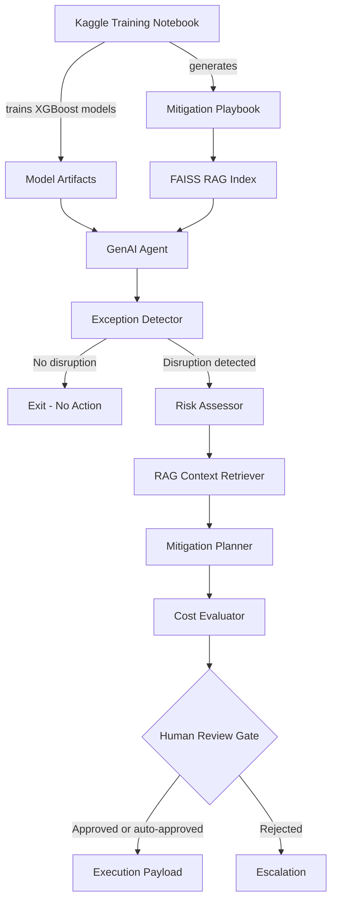

# Supply Chain GenAI Agent


End-to-end supply-chain disruption resolution system combining **XGBoost**, **RAG**, and a **LangGraph multi-agent workflow**.

> A portfolio project demonstrating how classical ML models and GenAI agents can be combined to detect supply-chain disruptions, retrieve mitigation knowledge, evaluate cost tradeoffs, and generate auditable decision payloads.

The project separates model training from GenAI inference:

- The notebook trains ML models and generates artifacts.
- The Python agent loads trained artifacts and runs the GenAI/RAG workflow.

---

## Project Overview

This system detects and resolves supply-chain disruptions using a hybrid ML + GenAI architecture.

It supports:

- Disruption detection using a trained XGBoost classifier
- Shipping-cost prediction using a trained XGBoost regressor
- RAG over a mitigation playbook using FAISS and HuggingFace embeddings
- Groq-hosted LLM reasoning for risk assessment and mitigation planning
- LangGraph-based multi-agent orchestration
- Pydantic structured outputs for schema-controlled agent responses
- Human-in-the-loop approval for high-risk or low-confidence decisions
- Audit trail and ERP/TMS-style execution payload generation
- Replay mode for historical Kaggle rows
- Separated training and inference artifacts for production-style deployment

---

## Motivation

Supply-chain teams often need to triage disruptions across route risk, product criticality, delay impact, cost tradeoffs, and mitigation options. This project explores how ML models and GenAI agents can work together to support faster, more auditable disruption-resolution decisions.

---

## Architecture



---

## Repository Structure

```text
supply-chain-genai-agent/
  README.md
  requirements.txt
  .env.example
  .gitignore

  supply_chain_genai_agent_groq_hf.py

  data/
    global_supply_chain_disruption_v1.csv

  notebooks/
    supply_chain_disruption_cost_model_training.ipynb

  supply_chain_agent_training_outputs/
    models/
      disruption_classifier.pkl
      cost_predictor.pkl
      cost_predictor_enhanced.pkl
      feature_config.json

    knowledge_base/
      mitigation_playbook.txt

    reports/
      metrics.json
      classifier_feature_importance.csv
      agent_compatible_cost_feature_importance.csv
      enhanced_cost_feature_importance.csv
```

The FAISS index is generated locally and is usually not committed:

```text
supply_chain_agent_training_outputs/
  knowledge_base/
    faiss_index/
      index.faiss
      index.pkl
```

---

## Main Components

### 1. Model Training Notebook

Location:

```text
notebooks/supply_chain_disruption_cost_model_training.ipynb
```

The notebook:

- Loads the supply-chain shipment dataset
- Engineers route, product, lead-time, weather, and geopolitical risk features
- Trains an XGBoost disruption classifier
- Trains XGBoost shipping-cost regressors
- Saves model artifacts
- Saves `feature_config.json` for train/inference feature consistency
- Generates `mitigation_playbook.txt` for the RAG agent
- Exports model reports and metrics

### 2. GenAI Agent

Location:

```text
supply_chain_genai_agent_groq_hf.py
```

The agent:

- Loads trained ML artifacts
- Builds or loads a FAISS vector index
- Retrieves mitigation context from the playbook
- Uses Groq LLMs for structured risk and mitigation reasoning
- Uses LangGraph to orchestrate the workflow
- Produces an audit trail and execution payload

---

## Agent Workflow

```text
Order Input
   |
   v
Exception Detector
   |
   | if disruption detected
   v
Risk Assessor
   |
   v
RAG Context Retriever
   |
   v
Mitigation Planner
   |
   v
Cost Evaluator
   |
   v
Human Review Gate
   |
   v
Execution Payload
```

If no disruption is detected, the workflow exits after the exception detector.

---

## Key Design Decisions

- **Separated training and inference** — The notebook trains models and writes artifacts; the agent only loads artifacts and performs inference.
- **LangGraph multi-agent design** — The workflow is split into detector, risk assessor, mitigation planner, cost evaluator, human-review, and execution nodes.
- **FAISS for local RAG** — FAISS keeps the project portable and easy to run locally without requiring a managed vector database.
- **HuggingFace embeddings** — Local sentence-transformer embeddings avoid embedding API costs and make the RAG layer easier to reproduce.
- **Groq LLMs** — Groq is used for fast structured reasoning in the risk and mitigation planning nodes.
- **Pydantic structured outputs** — Agent outputs are constrained to schemas, reducing invalid or inconsistent LLM responses.
- **Human-in-the-loop gate** — High-risk or low-confidence decisions are routed for approval before execution payload generation.
- **Replay mode** — Historical rows can be replayed using known disruption labels without leaking those labels into real-time JSON inference.

---

## Setup

### 1. Clone the repository

```bash
git clone https://github.com/Parthkh28/supply-chain-genai-agent.git
cd supply-chain-genai-agent
```

### 2. Create a virtual environment

On macOS/Linux:

```bash
python -m venv .venv
source .venv/bin/activate
```

On Windows PowerShell:

```powershell
python -m venv .venv
.\.venv\Scripts\Activate.ps1
```

### 3. Install dependencies

```bash
pip install -r requirements.txt
```

If installing manually:

```bash
pip install pandas numpy joblib scikit-learn xgboost "pydantic>=2,<3"
pip install langchain langchain-community langgraph faiss-cpu
pip install langchain-groq langchain-huggingface sentence-transformers
```

---

## Environment Variables

The agent reads environment variables from the shell. `.env.example` is provided as a reference; do not commit real API keys.

Required for Groq LLM calls:

```bash
GROQ_API_KEY=your_groq_api_key_here
```

Optional:

```bash
GROQ_MODEL=llama-3.3-70b-versatile
SUPPLY_CHAIN_MODELS_DIR=supply_chain_agent_training_outputs/models
SUPPLY_CHAIN_KB_DIR=supply_chain_agent_training_outputs/knowledge_base
SUPPLY_CHAIN_DATA_PATH=data/global_supply_chain_disruption_v1.csv
SUPPLY_CHAIN_REPLAY_MODE=0
```

On Windows PowerShell:

```powershell
$env:GROQ_API_KEY="your_groq_api_key_here"
$env:SUPPLY_CHAIN_DATA_PATH="data/global_supply_chain_disruption_v1.csv"
```

On macOS/Linux:

```bash
export GROQ_API_KEY="your_groq_api_key_here"
export SUPPLY_CHAIN_DATA_PATH="data/global_supply_chain_disruption_v1.csv"
```

---

## Usage

### 1. Check required artifacts

```bash
python supply_chain_genai_agent_groq_hf.py check
```

Expected artifacts:

```text
supply_chain_agent_training_outputs/
  models/
    disruption_classifier.pkl
    cost_predictor.pkl
    feature_config.json

  knowledge_base/
    mitigation_playbook.txt
```

### 2. Build the FAISS index

Run this once after cloning or after changing the mitigation playbook:

```bash
python supply_chain_genai_agent_groq_hf.py index
```

This creates:

```text
supply_chain_agent_training_outputs/
  knowledge_base/
    faiss_index/
      index.faiss
      index.pkl
```

The FAISS index uses local HuggingFace embeddings:

```text
sentence-transformers/all-MiniLM-L6-v2
```

### 3. Run on a historical Kaggle row

Use replay mode when running on historical CSV rows where `Disruption_Event` is already present.

```bash
python supply_chain_genai_agent_groq_hf.py resolve --order-idx 10 --replay-mode
```

### 4. Run with automatic HITL approval for demo mode

```bash
python supply_chain_genai_agent_groq_hf.py resolve --order-idx 10 --replay-mode --auto-approve
```

### 5. Run on a JSON order

```bash
python supply_chain_genai_agent_groq_hf.py resolve --order-json order.json
```

Example `order.json`:

```json
{
  "Order_ID": "DEMO-001",
  "Route_Type": "Suez",
  "Product_Category": "Pharmaceuticals",
  "Transportation_Mode": "Sea",
  "Geopolitical_Risk_Index": 0.82,
  "Weather_Severity_Index": 7.5,
  "Inflation_Rate_Pct": 5.2,
  "Scheduled_Lead_Time_Days": 24,
  "Base_Lead_Time_Days": 18,
  "Order_Weight_Kg": 1200,
  "Shipping_Cost_USD": 18500
}
```

Run:

```bash
python supply_chain_genai_agent_groq_hf.py resolve --order-json order.json
```

---

## Replay Mode

Replay mode is intended only for historical Kaggle/demo rows.

When enabled:

```bash
--replay-mode
```

or:

```bash
SUPPLY_CHAIN_REPLAY_MODE=1
```

the agent treats a non-empty `Disruption_Event` field as a known historical alert.

For real-time JSON inference, do not use replay mode.

---

## Demo Output

<details>
<summary>Sample disrupted-order run</summary>

```bash
python supply_chain_genai_agent_groq_hf.py resolve --order-idx 10 --replay-mode
```

```text
SUPPLY CHAIN GENAI AGENT RESULT
========================================================================
Order ID            : ORD-358B0702
Disruption Detected : True
Disruption Prob.    : 0.85
Disruption Type     : Geopolitical Conflict (Route Diversion)
Severity            : HIGH
Recommended Action  : Re-routing
Confidence          : 0.55
Requires HITL       : True
Final Decision      : None
```

The reasoning trace and audit log show how the decision was produced:

```text
[DETECTOR] Order ORD-358B0702: prob=0.850, rule_hit=True
[RISK] severity=HIGH
[PLANNER] generated mitigation options
[COST] selected best action based on utility and cost delta
```

</details>

---

## Model Artifacts

The agent expects the following model files:

```text
supply_chain_agent_training_outputs/
  models/
    disruption_classifier.pkl
    cost_predictor.pkl
    feature_config.json
```

Optional enhanced cost model:

```text
cost_predictor_enhanced.pkl
```

To use the enhanced model:

```bash
export SUPPLY_CHAIN_COST_MODEL_FILENAME=cost_predictor_enhanced.pkl
export SUPPLY_CHAIN_COST_FEATURE_KEY=cost_model_features_enhanced
```

On Windows PowerShell:

```powershell
$env:SUPPLY_CHAIN_COST_MODEL_FILENAME="cost_predictor_enhanced.pkl"
$env:SUPPLY_CHAIN_COST_FEATURE_KEY="cost_model_features_enhanced"
```

---

## Knowledge Base and RAG

The notebook generates:

```text
supply_chain_agent_training_outputs/
  knowledge_base/
    mitigation_playbook.txt
```

The agent converts this playbook into a FAISS vector index:

```bash
python supply_chain_genai_agent_groq_hf.py index
```

The RAG layer retrieves relevant mitigation examples for:

- Route disruptions
- Product-specific criticality
- Geopolitical conflicts
- Severe weather events
- Port congestion
- Alternative shipping strategies

---

## Model Reports

Training reports are saved under:

```text
supply_chain_agent_training_outputs/reports/
```

| Artifact | Purpose |
|---|---|
| `metrics.json` | Stores classifier and cost-model evaluation metrics |
| `classifier_feature_importance.csv` | Feature importance for the disruption classifier |
| `agent_compatible_cost_feature_importance.csv` | Feature importance for the default cost model |
| `enhanced_cost_feature_importance.csv` | Feature importance for the enhanced cost model |

These files summarize model performance and feature importance for the trained XGBoost models.

---

## Production Extensions

This project is designed as a local/demo portfolio system.

The current implementation:

- Generates ERP/TMS-style execution payloads
- Does not directly call external ERP or TMS APIs
- Uses Groq for LLM calls
- Uses HuggingFace embeddings locally
- Uses FAISS for local vector search
- Uses LangGraph memory for workflow checkpointing

Recommended production additions:

- FastAPI service wrapper
- Persistent LangGraph checkpoint store
- Authentication and authorization
- LangSmith or Langfuse tracing for agent observability
- MLflow model versioning
- Managed vector database such as Pinecone, Weaviate, or Milvus for scale
- Live ERP/TMS API integration
- Model monitoring and drift detection
- CI/CD, Docker, and cloud deployment

---

## Resume Summary

> Built a LangGraph multi-agent pipeline for supply-chain disruption resolution, combining RAG with FAISS, HuggingFace embeddings, Groq LLMs, and Pydantic structured outputs across risk assessment, mitigation planning, cost evaluation, and HITL approval.
>
> Trained XGBoost classifier and cost regressor on 10K shipment records for disruption detection and shipping-cost prediction, with separated training and inference artifacts for production-style deployment.

---

## Tech Stack

| Category | Tools |
|---|---|
| ML / Training | XGBoost, Scikit-learn, Pandas, NumPy |
| GenAI / Agents | LangGraph, LangChain, Groq LLMs |
| RAG / Retrieval | FAISS, HuggingFace Embeddings, SentenceTransformers |
| Structured Output | Pydantic v2 |
| Serialization | Joblib, JSON |
| Data / Notebook | Kaggle, Jupyter Notebook |
| Runtime | Python 3.10+ |

---

## License

This project is intended for educational and portfolio use.
